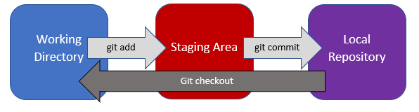

# GIT

*   **git init:** initializes git repository
*   **ls -a** shows the hidden files and git.
*   **git status** shows the staging area. Also shows if there is any modifications in the files.
*   **git add** adds the file into the staging area to start tracking changes.
    *   **git add chapter1.txt** adds chapter1.txt file into the staging area.
    *   **git add .** adds all the files inside the current directory into the staging area. Useful to add multiple files at once, rather than adding them one by one .
*   **git commit** commits the changes.
    *   **git commit -m “Complete Chapter 1”** using -m flag adds a comment message to the commit. Message should be in present tense.
*   **git log** shows the commits that are done.
*   **git checkout** reverts back to the last position in our local repository.
    *   **git checkout chapter3.txt**
*   **git diff** shows the differences between the current version of the file and the last save point in our git repository.
    *   **git diff chapter3.txt** will show the differences between the versions of chapter3.txt inside the git repository.
*   **git rm --cached -r .** will remove all of these things have been removed from the Git staging area. ( r is the recursive flag)
*   **--cached** flag is only removing files from the staging area but leaving them in the working directory. Useful when you may want to keep the file on your hard drive but not have Git track it anymore.

Staging area is like a stage where the files that are going to be tracked, perform. Files in the staging are ready to be committed.

Staging area is a good place to try and figure out what are the things you want Git to ignore and what are the things you want to be tracked.

Commiting in 3 steps :

## Github

Pushing commits onto Github:

We should first create a “remote”, so it’s telling my local Git repository that I’ve created a remote repository somewhere on the internet and I want to transfer all of my commits over there.

**Local** repository is in your **computer**, **remote** repository is on the **internet** , namely github.

*   **git remote add origin “url”**
    *   (origin is the name of the remote. You can name it anything you want but naming it origin is highly recommended since it’s conventional naming.)
    *   (url is the our remote repository’s url.)
    *   **git remote add origin https://github.com/onuraksar/Story.git**
*   **git push -u origin master** pushes your local repository to the remote repository using the -u flag.
    *   origin is the name of the remote.
    *   master is the name of the branch.
    *   Master branch is simply the default branch or the main branch of all of your commits or save files and it is sequential.
*   **git clone** clones the remote repository to local repository. ( vice versa of push). Cloning basically downloads the code files into your system.

## gitignore

Put the unnecessary files and files with sensitive information into the gitignore before you are commiting.

1.  **touch .gitignore** //create the gitignore file.
2.  **start .gitignore** // open the gitignore file in a text editor.
3.  Add the file names in each line on the text editor.
4.  Save the .gitignore file.

You can check files by using **git status** command.

You can also check [Github](https://github.com/github/gitignore) for useful gitignore templates

## Branching and Merging

Sometimes you are developing new feautures, fixing bugs and all of these things may break your main project so you don’t want to do it on the **master branch**.

You only want to put it onto the master branch once you’ve tested, once you know **everything is working fine**.

Therefore instead of continuing to commit to the master branch, which is the main branch, we can also create a **side branch**. And we can start commiting to this new branch or **experimental branch**. Simultaneously we can continue working on the main branch as well.

If at some point in the future that we decide that experiment was successful and we’d like to **merge** it back to the main branch by placing a **merge request** in. Then we can continue from here onto the next commit or we can make more branches.

*   **git branch branchname** creates a new branch.
    *   **git branch alien-plot** creates a new branch named “alien-plot”.
    *   **git branch** prints the branches you have. * points to the current branch.
*   **git checkout alien-plot** switches to other branch named "alien-plot".
*   **git merge alien-plot** merges alien-plot branch into the master branch. ( while we are inside the master branch)